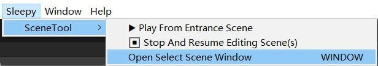
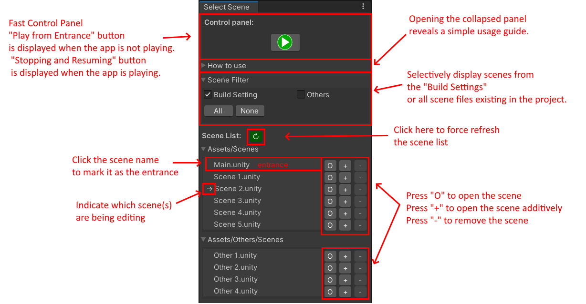

# Sleepy Scene Tool (for Unity)

Author: He Yiran (SleepyCat)         
Version: 1.2.3      

## Description
In many **Unity** projects, there is a designated entrance scene from which
the project must be started each time.   
However, developers often need to switch to and edit other scenes,
making the process of scene switching tedious and cumbersome.    

Sleepy Scene Tool simplifies the scene transition workflow,
making it easier to focus on the development and editing process.
The system aims to streamline this workflow with the following
features:     

- **Automated Scene Listing:**    
Automatically fetches all scenes and provides a convenient list
for selecting the entrance scene.
You can also use out filter to list only the scenes in the build
settings or include the others.

- **Easy Scene Access:**    
Directly open or additively open scenes from the list for
editing, saving you the hassle of manual searching.

- **Quick Play from Entrance Scene:**    
A menu option to quickly launch the project from the entrance
scene, no matter which scene(s) you are currently editing.

- **Seamless Stop and Resume:**    
Another menu option to stop the running project and swiftly
resume editing the previously open scene(s).
Usage

## Usage

All the actions are included in the `Sleepy/SceneTool` menu.      
     
👆You shall see this menu after importing this package correctly.   

- **Scene Selector Window:**     
Use the `Sleepy/SceneTool/Open Select Scene Window` menu
option to open the Scene Selector Window.    
This is the central control of our plugin.        
In this window, you can choose the entrance scene and switch
between scenes as needed.     
   

- **Playing from Entrance Scene:**    
Use the `Sleepy/SceneTool/ ▶ Play From Entrance Scene`
menu option to load the entrance scene and start running the
project.
(**Note:** If you haven't pre-selected an entrance scene via
the Scene Selector Window, the default scene path
`"Assets/Scenes/Main.unity"` will be used as the entrance.)

- **Stopping and Resuming:**   
While the project is running, use the `Sleepy/SceneTool/
⏹ Stop And Resume Editing Scene(s)` menu option to stop the
project and resume editing the previously open scene(s).

